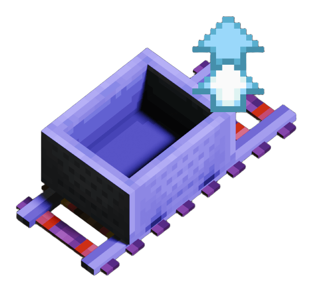

<div style="text-align: center;">



# BetterRailwaySystem Mod

**BetterRailwaySystem 是一个基于 Fabric 的 Minecraft 模组，在不替换原版矿车和铁轨系统的前提下增强其功能。**

[English](../README.md)｜简体中文
</div>

目标：

- 完整兼容原版铁轨、动力铁轨、检测铁轨、激活铁轨以及红石行为
- 增强矿车运动、运营、站点处理和线路管理能力
- 不引入类似 [MTR](https://modrinth.com/mod/minecraft-transit-railway) 那样的独立铁路系统

## 当前范围

本模组围绕原版矿车实体与原版铁路网络构建。

当前已实现的功能方向包括：

- 增强原版矿车物理和控制逻辑
- 用于发车、停车、回收和报站的铁路运营方块
- 世界线路录入与线路图可视化
- 游戏内配置、指令和 Balise 素材管理

## 功能特性

### 矿车行为

- 矿车在已充能动力铁轨上平滑加速，而不是瞬间跳到最高速
- 矿车在未充能动力铁轨上平滑减速，而不是立刻急停
- 支持以 `Blocks / Second` 为单位配置 `maxSpeed`、`acceleration`、`deceleration`
- 支持配置安全跟车距离，用于同轨前方矿车的自动刹车
- 临时受阻或反弹后可自动恢复并重新加速
- 使用基于子步进的高速铁路运动逻辑以提升高速转弯和爬坡稳定性（参考 [Fast Minecart](https://modrinth.com/mod/fast-minecart)）
- 针对原版铁轨的坡道与高速运行进行了动量保持优化
- 矿车运行时可强制加载区块
- 无人乘坐的矿车会在可配置时间后自动删除
- 关闭矿车对实体的碰撞推动行为，以减少堵塞

### 多人乘坐矿车

- 默认一辆矿车最多可搭载 `24` 名玩家
- 所有玩家共用同一个原版矿车实体
- 每位玩家都保留正常的本地第一人称和第三人称显示
- 同车其他乘客会被隐藏，避免模型重叠
- 保留原版下车流程

### 铁路应答器（信标）

`railway_balise` 是用于触发运营事件的轨旁方块。

已支持的应答器模式：

- `到达`
- `发车`
- `广播`
- `限速开始`
- `限速结束`

应答器支持的行为包括：

- 仅向当前矿车乘客发送标题和副标题广播
- 仅向当前矿车乘客播放自定义音频
- 仅向当前矿车乘客显示自定义 HUD 图片
- 图片可选持续显示到下一个应答器，或直到玩家下车
- 更新当前站与下一站状态
- 可选为车上乘客更新 BossBar
- 通过限速开始/结束标记实现临时区间限速

### 停车轨（虽然不是轨道，历史遗留懒得改名了）

`stop_rail` 是用于精确停车的控制方块。

支持的行为：

- 可配置停车距离
- 可配置停站时间
- 等待模式：`立刻`、`计时器`、`红石控制`
- 释放后自动重新起步，并带有短暂起步助推，避免矿车卡住

### 发车块

`train_spawner` 方块可以在现有原版铁轨上自动生成矿车。

支持的设置：

- 城市名称
- 线路编号
- 线路主题色
- 发车方向
- 目标车数自动发车
- 红石控制发车
- 环线标记

发车块行为：

- 仅在方块本体或上方存在有效铁轨时发车
- 若发车区域已有其他矿车占用则拒绝发车
- 会按配置方向或自动识别的轨道方向自动起步
- 为生成的矿车绑定城市、线路、颜色、线路录入和环线状态
- 强制保持发车块所在区块已加载

### 收车块

`train_collector` 方块作为线路终点回收点使用。

支持的行为：

- 矿车到达后直接移除
- 在移除前将经过的站点记录到世界铁路线路图
- 同时保存线路颜色、站点顺序和站点坐标

### 线路图（WIP)

现已删除所有线路图相关功能，日后重构
模组同时提供车上线路图和世界铁路网视图。

支持的行为：

- 使用键位 `` ` `` / `~` 打开地图
- 乘坐矿车时打开当前线路图
- 未乘坐矿车时打开世界铁路网
- 按城市分组显示线路
- 同一城市内相同站名自动合并为换乘站
- 在线路图和 BossBar 中显示线路主题色
- 支持站点搜索
- 支持鼠标滚轮缩放
- 支持拖拽平移
- 鼠标悬停站点时显示站名、城市、所属线路和保存坐标
- 按城市显示右侧线路颜色对照表
- 可在配置界面中清除全部、单个城市或单条线路的铁路网数据

### BossBar 与线路主题色

- 为车上乘客显示“当前站 / 下一站”BossBar
- BossBar 颜色会跟随线路主题色
- 线路主题色也会用于已保存线路数据与地图渲染

### 铁路应答器素材库

可在游戏内素材库界面管理自定义媒体资源。

支持的行为：

- 图片素材库
- 音频素材库
- 上传新的 `.png` 图片和 `.ogg` 音频
- 已上传素材会记录上传者，并在客户端素材库界面显示
- 单击即可预览素材
- 直接将素材标识填入 Balise 编辑器
- 自动生成并重载本地资源包以使用已同步素材

### 联机与素材同步

- 支持专用服务器，但服务端与客户端都需要安装本模组
- 服务端运行时还需要安装 `Fabric API` 与 `cloth-config-fabric`
- 如果连接的服务器未安装 BetterRailwaySystem，客户端里的线路图请求、铁路网控制和 Balise 素材同步等功能会自动禁用
- 应答器素材会先由客户端上传到服务端，再由服务端分发给所有在线且安装了模组的客户端
- 后加入的玩家也会自动收到当前服务端素材库
- 在专用服务器中，应答器素材上传默认只允许 OP 使用

### 配置

当前可用的配置项包括：

- `maxSpeed`
- `acceleration`
- `deceleration`
- `safeFollowingDistance`
- `maxPassengers`
- `stopRailApproachDistance`
- `unattendedDespawnSeconds`

配置方式包括：

- 游戏内配置界面
- 指令：`/betterrailwaysystem config show`、`/betterrailwaysystem config reload`、`/betterrailwaysystem config set <key> <value>`

## 环境

- Minecraft `1.21.1`
- Fabric Loader
- Fabric API
- Yarn mappings
- Java `21`

## 开发

常用命令：

```bash
./gradlew build
./gradlew runClient
```

## 项目结构

源码结构：

- `src/main/java/org/dcstudio/minecart` 矿车运行时逻辑
- `src/main/java/org/dcstudio/renderer` 客户端界面与 HUD 渲染
- `src/main/java/org/dcstudio/network` 客户端/服务端数据包与同步逻辑
- `src/main/java/org/dcstudio/station` 铁路方块与方块实体逻辑
- `src/main/java/org/dcstudio/config` 配置与指令处理

## 说明

- 模组 id 为 `betterrailwaysystem`
- 所有自定义行为都建立在原版铁轨之上，而不是替换原版系统
- 模组保持对原版动力铁轨、检测铁轨、激活铁轨和普通铁轨的兼容
- 列车运行、站点事件和线路录入全部基于原版矿车实现

## 许可证

本仓库采用 `GPL-3.0` 许可证。详见 [LICENSE](../LICENSE)。

模组图标中 3D 模型的原作者：
[Mareon](https://sketchfab.com/3d-models/minecraft-powered-rail-1d23a225ea6f4ec8b357f12ad6588182)，
[khj008008](https://sketchfab.com/3d-models/minecraft-minecart-2nd-8d46f8e5649246d5a2dc034fffa7c79d)
